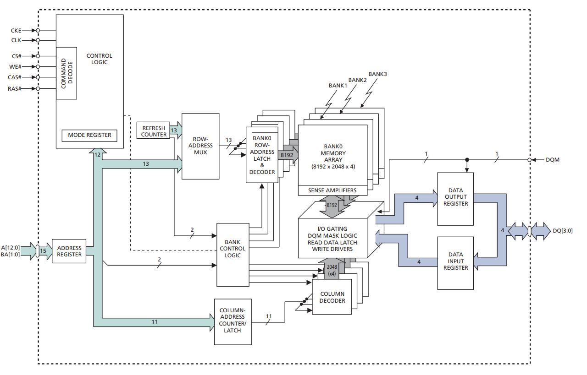
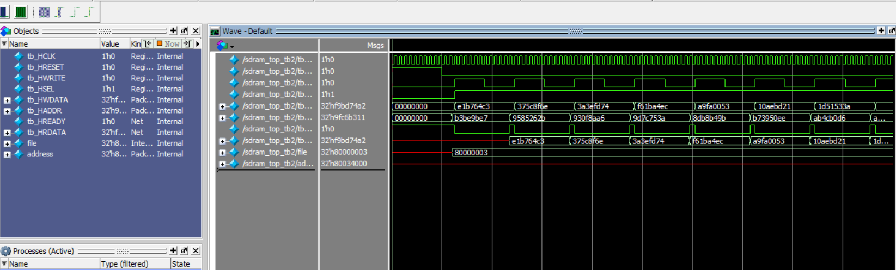
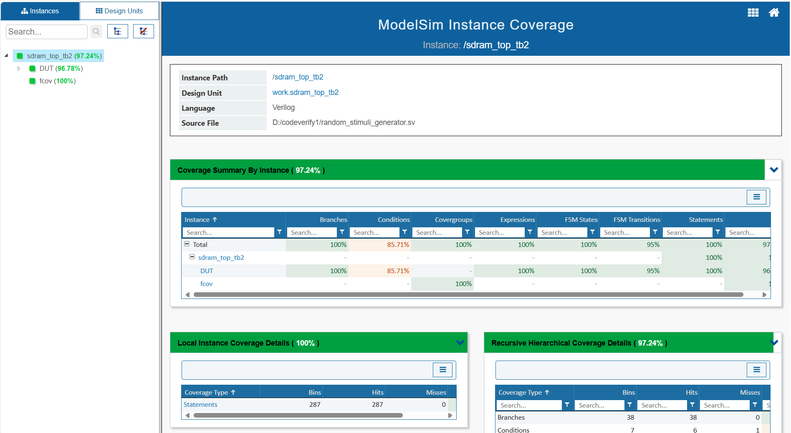

# SDRAM-Functional-Verification-Project


## Overview

This project presents a complete functional verification environment for an SDRAM controller using **SystemVerilog** and **ModelSim**.  
The project was developed as part of the **HDL Model Verification** course at the University of Tehran under the supervision of **Dr. Siamak Mohammadi**.

The verification environment was incrementally developed through multiple project phases, including:

- Deterministic stimulus generation
- Random/semi-random stimulus generation
- Golden model implementation
- Checker and scoreboard design
- Assertion-based verification
- Functional coverage collection
- Code coverage analysis

The final implementation achieved:

- ✅ **100% Functional Coverage**
- ✅ **97.24% Code Coverage**

---

## Verification Architecture

The verification environment includes the following components:

- **Stimulus Generator**
  - Deterministic scenarios
  - Randomized scenarios

- **Golden Model**
  - Reference SDRAM behavior modeling

- **Checker**
  - Output timing and data validation

- **Scoreboard**
  - DUV vs Golden Model comparison

- **Assertions**
  - Protocol and behavior checking

- **Functional Coverage**
  - Coverage-driven verification

---

## Verification Scenarios

Implemented test scenarios include:

- Memory write/read operations
- Accessing different memory banks and rows
- Consecutive read/write transactions
- Reset behavior validation
- Invalid `X` value testing for write signal
- Corner-case verification
- Randomized transaction generation

---

## Project Structure

```bash
├── src/
│   ├── sdram_controller.v
│   ├── sdram_model.v
│   ├── sdram_top.v
│   ├── testbench.v
│   ├── random_stimuli_generator.sv
│   ├── checker.sv
│   ├── scoreboard.sv
│   ├── Golden_Model_sdram.sv
│   ├── functional_coverage.sv
│   └── sdram_assertions.sv
│
├── Simulation/
│   ├── modelsim.ini
│   ├── wave.do
│   ├── compile.do
│   └── simulation_outputs/
│
├── Coverage Report/
│   └── coverage_report.pdf
│
└── README.md
```
## SDRAM Design Schematic

The following figure illustrates the SDRAM architecture and internal modules used in the verification process.

<p align="center">  </p>

## ModelSim Waveform Results

The waveform below demonstrates successful SDRAM write/read operations and validates correct timing behavior between the DUV and Golden Model.

<p align="center">  </p>

## Functional & Code Coverage Report

Coverage analysis was performed using ModelSim coverage tools.

 Final results:

* Functional Coverage: 100%
* Code Coverage: 97.24%
<p align="center">  </p>

## Tools & Technologies
* SystemVerilog
* Verilog HDL
* ModelSim SE-64 2020.4
* Assertion-Based Verification (ABV)
* Functional Coverage
* Coverage-Driven Verification
* 
## Course Information
* Course: HDL Model Verification
* Instructor: Dr. Siamak Mohammadi
* University: University of Tehran
* Semester: Fall 2024
## Key Achievements
* Designed a complete reusable verification environment
* Implemented deterministic and random stimulus generators
* Developed a cycle-accurate SDRAM Golden Model
* Built checker and scoreboard modules
* Achieved full functional coverage
* Performed comprehensive code coverage analysis
## License

This project is intended for educational and academic purposes.


---
